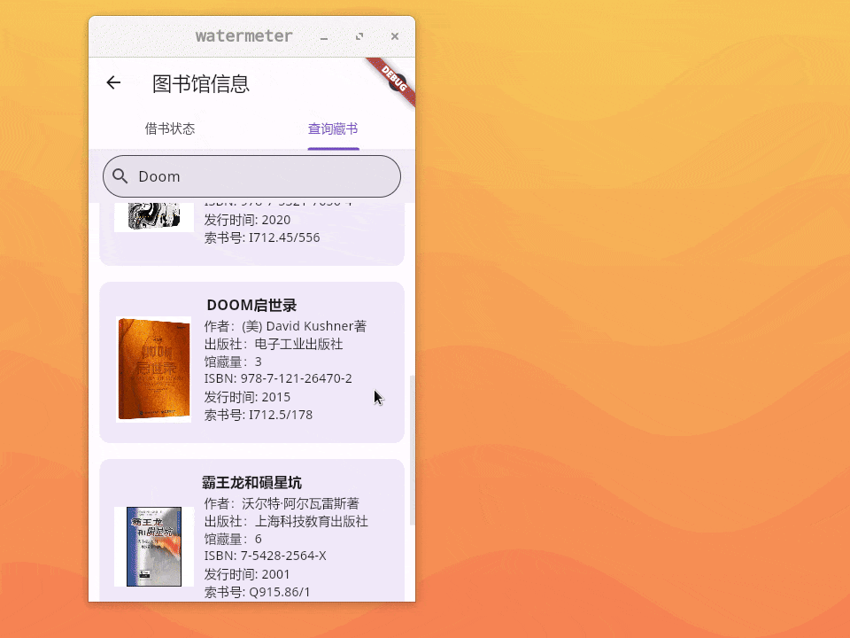

# both_side_sheet

A pop up which can transfer between Bottom Sheets and Side Sheets from divider.

Bottom Sheets and Side Sheets are defined at Material 3 Website.



## Getting started

Add this to the `pubspec.yaml`:

```
both_side_sheet: 
```

Or execute this:

```
flutter pub add both_side_sheet
```

## Usage

```dart
import 'package:both_side_sheet/both_side_sheet.dart';

BothSideSheet.show(
    context: context, // BuildContext of the context.
    title: "Both Side Sheet Example", // Title which used in Side Sheets. 
    child: // Just whatever widget you like.
),
```

You can see the example project, it have a popout with data.

## Additional information

Diverse from Traintime PDA codebase, added divider.

Improvement, ideas are welcome.

## (In Chinese) How this stuff works.

如你所见，在竖屏的时候，他是从底往上呼出的，跟 BottomSheet 一样；在横屏的时候，他是从右向左呼出的，和 SideSheet 一样。

Flutter 的 Material 框架本身没有实现 SideSheet ，而对于横屏来说，BottomSheet 是十分浪费屏幕，而且不太好看，从左面呼出是更合适的。得亏有很多的大佬，自行实现了 SideSheet 插件，我可以直接拿来使用他们的概念，但我想把这两个结合在一起。

而为啥要将这两个东西合在一起呢？这就涉及到实际使用中，我们是如何呼出 BottomSheet 了。

呼出 BottomSheet 和呼出 Dialog 一样，是使用了一个函数，在这里，叫 showBottomSheet。这玩意有个问题，他本质上是往路由栈里面压入一个 BottomSheet 页面栈，也就是说，无论横屏幕还是竖屏幕，他永远是 BottomSheet，而不会变化一点。我一开始用了 SideSheet，结果发现横屏开了 SideSheet，竖屏过来了还是 SideSheet，他们之间不会互相转化。

那我就缝合吧，SideSheet 好办，抄过来先辈的代码就好了，顺便我抄过来使用 showGeneralDialog 来显示弹窗了。但是 BottomSheet 本身并没有任何代码资料，我只能自己写了。我使用了 StatefulWidget 来保存 heightForVertical 变量，这是个高度变量，默认为页面高度的 80% 。然后我使用了一个 GestureDetector ，手势侦测器。这个侦测器在拖拽最上面的小横杠时候进行当前高度检测，然后更新高度。这里我将收起的高度定为页面高度的 40% 。

这里我说明一下 BottomSheet 和 SideSheet 的特点，他们都可以分成两个部分，上面的和下面的。下面的是传参传进来的部件，上面的就是属于部件的东西了。

最后再说一句，原来的 SideSheet 的最上面是使用 AppBar 实现的，但是 AppBar 会侦测手机的状态栏，最终导致在某些情况下，上面的高度过高。我被迫自行实现了这里，搞得很难看。
